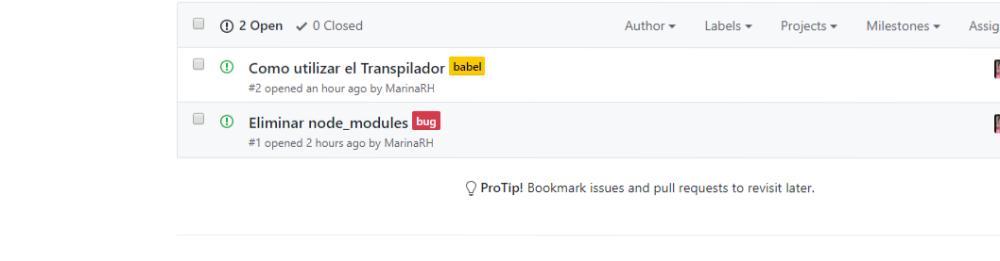
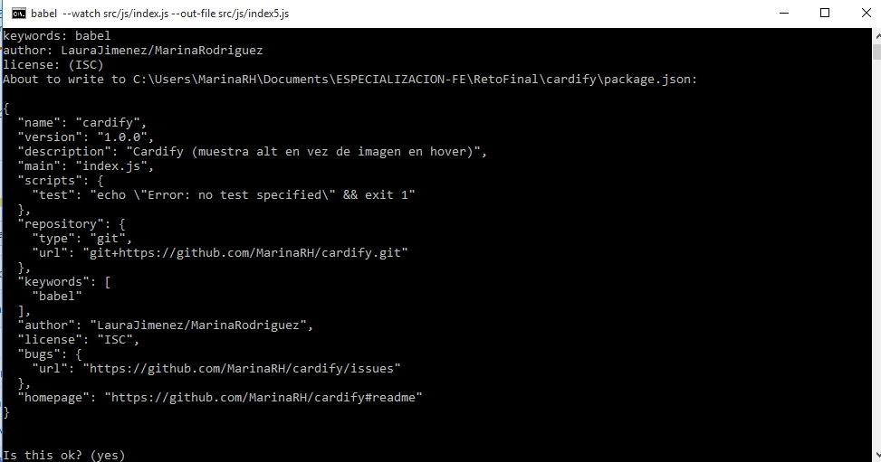

# Cardify

* **Track:** _Common Core_
* **Curso:** _JS Deep Dive: Crea tu propia librería usando JavaScript_
* **Unidad:** _Producto final_

***

## Plan de Accion

1. Eleccioon del Reto 

>* Implementar un plugin de jQuery que dado un _contenedor_ debe buscar todas las
imágenes que encuentre dentro del _contenedor_ y reemplazarlas por un nuevo
elemento `<figure>` que contenga la imagen (``) además de un `<figcaption>`
con el texto del atributo `alt` de la imagen.

>* Escogimos esta idea porque toda web o app cuanto con un minimo de una imagen,pero muchas veces sucede que queremos tener una breve descripcion de la imagen y para ello,este plugins sera de gran *utilidad* y *simplificara* el trabajo en gran medida.

2. Organizacion.

Nos organizamos delegando responsabilidades en temas especificos.

+ LAURA :Investigar sobre las librerias ,Comenzar con la estructura basica.
+ MARINA :Investigar sobre el Compilador Babel,instalar las dependencias.

Trabajamos con Issues que nos sirve para identificar nuestros principales problemas durante el proceso.



3. Proceso.

* Inicializando *npm init*.
* Instalando las dependencias *package.json* y el transpilador *Babel*.
* Creandon el archivo *babelrc* (que realiza el cambio de ES6 a ES5).



* Agregando *.gitignore*(Nos sirve para ignorar carpetas que no se deben mostar en el git).
```js

 (*.DS_Store
node_modules)
```
* Empezamos con la estructura de la pagina principal *index.html*.

## Uso

```js
// `container` es el selector del contenedor donde se buscarán todas las
// imágenes a ser procesadas.
$(container).cardify({});
```

## Ejemplos

...
## Recursos

- html,css,javascript
- Bootstrap(framework)
- Babel (transpilador)