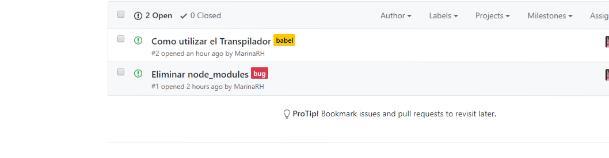
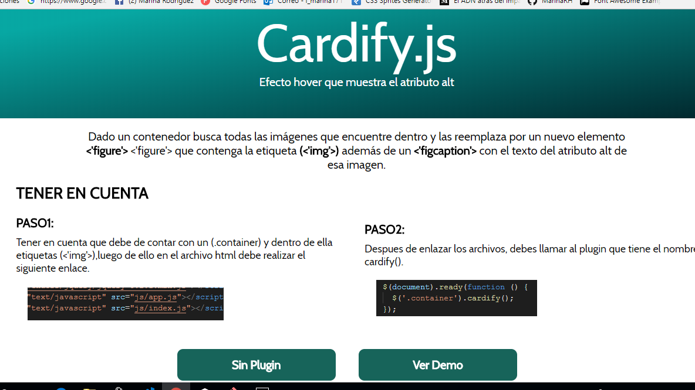
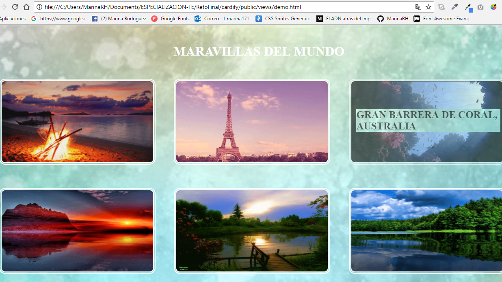

# Cardify

* **Track:** _Common Core_
* **Curso:** _JS Deep Dive: Crea tu propia librería usando JavaScript_
* **Unidad:** _Producto final_

*** 
[DEMOSTRACION DEL PLUGIN](https://marinarh.github.io/cardify/public/index.html).

***
## Plan de Accion

1. ELECCION DEL RETO 

>* Implementar un plugin de jQuery que dado un _contenedor_ debe buscar todas las
imágenes que encuentre dentro del _contenedor_ y reemplazarlas por un nuevo
elemento `<figure>` que contenga la imagen (``) además de un `<figcaption>`
con el texto del atributo `alt` de la imagen.

>* Nuestro plugin sera de gran *utilidad* y *simplificara* el trabajo de mostrar un pequeño titulo de la imagen que lo obtenemos del atributo *alt*.

2. ORGANIZACION.

Nos organizamos delegando responsabilidades en temas especificos.

+ LAURA :Investigar sobre las librerias ,Comenzar con la estructura basica.

+ MARINA :Investigar sobre el Compilador Babel,instalar las dependencias.

Trabajamos con Issues que nos sirve para identificar nuestros principales problemas durante el proceso y poder llevar una lista de las tareas a realizar.



3. PROCESO.

* Inicializando *npm init*.
* Instalando las dependencias *package.json* y el transpilador *Babel*.
* Creando el archivo *babelrc* (que realiza el cambio de ES6 a ES5).
* Agregando *.gitignore*(Nos sirve para ignorar carpetas que no se deben mostar en el git).

```js
 (*.DS_Store
node_modules)
```
* Empezamos con la estructura de la pagina principal *index.html*.

## Requerimientos
1. Instalar NodeJs en la maquina.
> npm install
2. Instalar el transpilador de Babel(Realiza transpilacion de ES6 a ES5)
> npm install --save-dev babel-cli babel-preset-env.
3. Contar con un contenedor de etiquetas *img* para hacer uso del plugins.

## Uso
* Para el uso ,previamente tenemos que tener enlazado el plugin a nuestra pagina.

```js
  <script type="text/javascript" src="../js/index.js"></script>
```
* Luego hacer el llamado en nuestro archivo .js.

```js
// `container` es el selector del contenedor donde se buscarán todas las
// imágenes a ser procesadas.
$(container).cardify({});
```

## Ejemplos





## Recursos

- html,css,javascript.
- jquery.
- Babel (transpilador).

## Integrantes(GitHub)

* [LAURA JIMENEZ](https://github.com/LauraJH16)
* [MARINA RODRIGUEZ](https://github.com/MarinaRH)